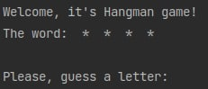
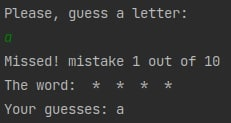
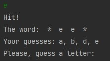
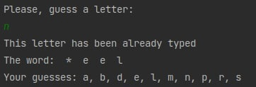
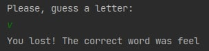
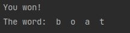

## Виселица
Игра начинается с приветствия с закрытого слова, которое нужно отгадать. Оно выбирается рандомно из слов файла *resources/words.txt*  

В случае неудачной попытки сообщается о промахе, выводится номер ошибки из позволенного количества:  

В случае попадания открываются все позиции угаданной буквы:  

Также запоминаются все попытки игрока, если вновь введенная буква уже была, то об этом сообщается игроку.  

Если игрок сделал позволенное количество попыток и не угадал слово, игра заканчивается, и пишется загаданное слово:  

Иначе игрок победил:  

